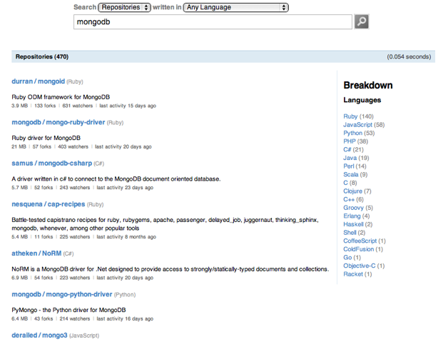

!SLIDE

# today #

!SLIDE bullets incremental
# You Should #

* use open source libraries
* open source company code
* use open source to recruit
* use open source to find developers
* learn from the open source model

!SLIDE subsection
# use open source libraries #

!SLIDE 
# do not reinvent the wheel #

!SLIDE center

## github.com ##

!SLIDE center

!SLIDE center

!SLIDE 
# get more stable, tested code than NIH #

!SLIDE 
# faster development than NIH #

!SLIDE 
# become part of a community #

!SLIDE 
# GitHub examples #

!SLIDE list

### vendor/gems ###

<table class="listtb"><tr><td>
BlueCloth-1.0.0 
addressable-2.1.1 
ar-extensions-0.8.1 
archive-tar-minitar 
aws-hack-s3-0.5.1 
aws-s3-0.5.1 
color-1.4.0 
creole-0.3.6 
diff-lcs-1.1.2 
eycap-0.3.1 
ezcrypto-0.7.2 
faker-0.3.1 
faraday-0.3.1 
fastercsv-1.4.0 
googlebase-0.2.1 
googlecharts-1.3.6 
machinist-1.0.6 
</td><td>
http_token_authentication 
maruku-0.6.0 
mechanize-0.7.5 
mime-types-1.15 
mocha-0.5.6 
money-1.7.1 
multipass-1.2.3 
oauth2-0.0.8 
org-ruby-0.5.3 
redis_namespace 
redis_rb 
rtimeout-1.0.1 
rubypants-0.2.0 
running_man 
solr-ruby-0.0.8 
test-spec-0.4.0 
unicorn-0.97.0 
</td></tr></table>

